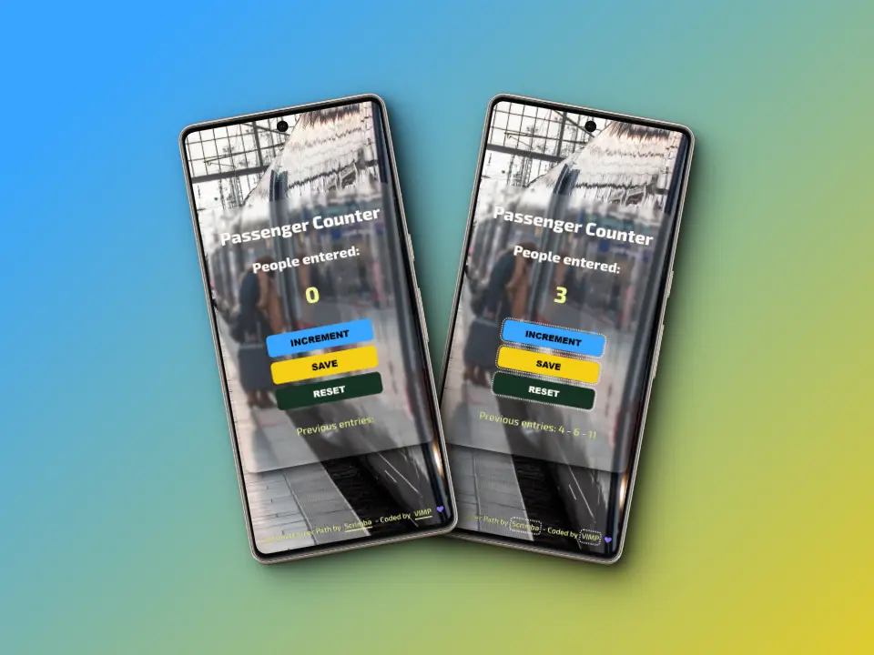
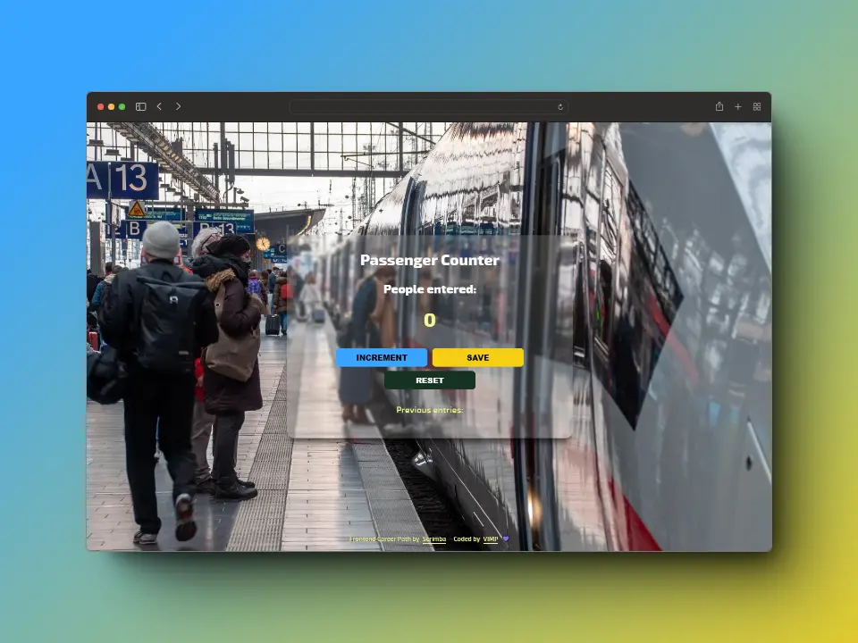

# Passenger Counter
This is my solution from the project: **Passenger Counter** from [**Frontend Career Path**](https://scrimba.com/learn/frontend) - Module 3 by [**Scrimba**](https://scrimba.com/).


### Table content
+ [The challenge](#the-challenge)
+ [Screenshots](#screenshots)
+ [Links](#links)
+ [I learnt](#i-learnt)
+ [Useful resources](#useful-resources)
+ [Author](#author)


## *The challenge*

🎯 When clicking on the ***INCREMENT*** button, increase the value of the counter and render it.

🎯 When clicking the ***SAVE*** button, display the current value of the counter in the <p> tag.

🎯 When clicking the ***RESET*** button, reset the variables to their initial value.

🎯 View the optimal layout depending on their device's screen size.

🎯 Show ***hover*** and ***focus-visible*** state for buttons and ***footer*** calls-to-action

## *Screenshots*

### 📱 Mobile



### 💻 Desktop



## *Links*

[Live](https://mendez-v.github.io/passenger-counter/) 👀

[Scrim](https://scrimba.com/scrim/cBerPytw) 👀

[Frontend Career Path](https://github.com/mendez-v/frontend-career-path) 👀

## *I learnt*

🔰 `.slice(indexStart, indexEnd)` - String method, extracts a string section and returns it as a new string, without modifying the original string.

```js
saveEl.textContent = "Previous entries: " + saveCount.slice(0, -3);
```


## *Useful resources*

🤓 `slice()` method by [MDN](https://developer.mozilla.org/en-US/docs/Web/JavaScript/Reference/Global_Objects/String/slice)

🌈 Image - <a href="https://pixabay.com/users/12138562o-12138562/?utm_source=link-attribution&utm_medium=referral&utm_campaign=image&utm_content=7058392">12138562O</a> from <a href="https://pixabay.com//?utm_source=link-attribution&utm_medium=referral&utm_campaign=image&utm_content=7058392">Pixabay</a>

🌈 Favicon - <a href="https://iconscout.com/icons/timer" class="text-underline font-size-sm" target="_blank">Timer</a> by <a href="https://iconscout.com/contributors/becris" class="text-underline font-size-sm">KANDA EUATHAM</a> on <a href="https://iconscout.com" class="text-underline font-size-sm">IconScout</a>

## *Author*

✨ Frontend Mentor - [@mendez-v](https://www.frontendmentor.io/profile/mendez-v)


<!-- favicon -->
